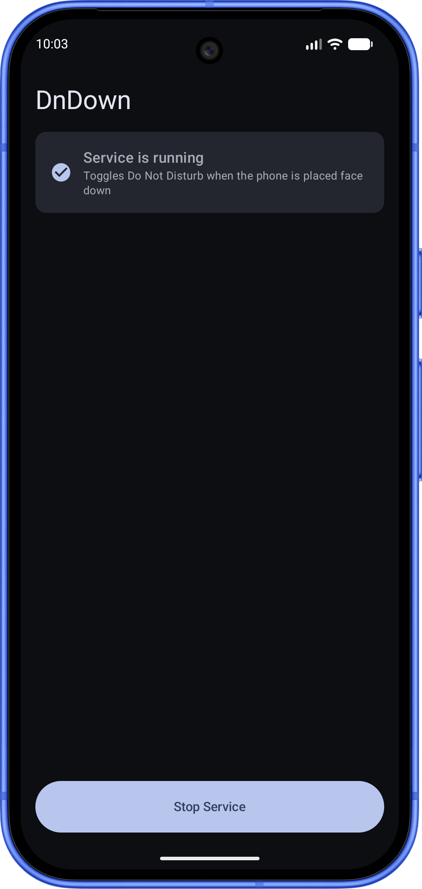

# DnDown

DnDown is a simple Android utility that automatically enables "Do Not Disturb" (DND) mode when you place your phone face down on a surface, and disables it when you pick it up.

  

## Features

- **Automatic DND**: Toggles "Do Not Disturb" mode based on device orientation.
- **Foreground Service**: Ensures reliable monitoring even when the app is in the background.
- **Haptic Feedback**: Provides a quick vibration when DND mode is activated to confirm it's working.
- **Battery Optimization Handling**: Guides users to disable battery optimizations to ensure the service runs uninterrupted.
- **Modern UI**: Built with Jetpack Compose and Material 3.

## Permissions Required

To function correctly, DnDown requires the following permissions:
- **Do Not Disturb Access**: Necessary to toggle the system's interruption filter.
- **Post Notifications**: Required to show the foreground service notification (Android 13+).
- **Battery Optimization Exemption**: Recommended to prevent the system from killing the background service.

## Getting Started

### Prerequisites
- Android device running Android 10 (API level 29) or higher.
- Android Studio Ladybug or newer for development.

### Installation
1. Clone the repository.
2. Open the project in Android Studio.
3. Build and run the app on your device.
4. Grant the necessary permissions when prompted.
5. Toggle the service "On" and try placing your phone face down!

## Project Structure

- `app/src/main/java/com/flf/dndown/service/`: The foreground service (`DnDService`) and its running-state tracker.
- `app/src/main/java/com/flf/dndown/core/`: Contains the logic for face-down detection and system interactions (DND, vibration).
- `app/src/main/java/com/flf/dndown/ui/`: Jetpack Compose UI components for the main screen.

## License

This project is licensed under the MIT License - see the [LICENSE](LICENSE) file for details. 
